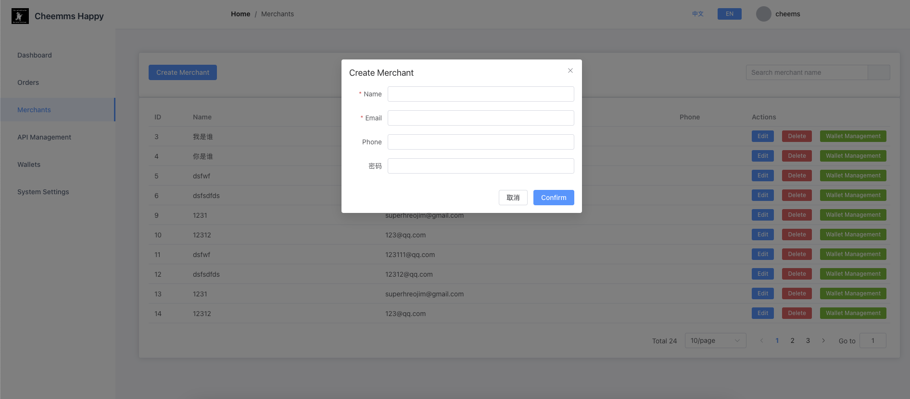
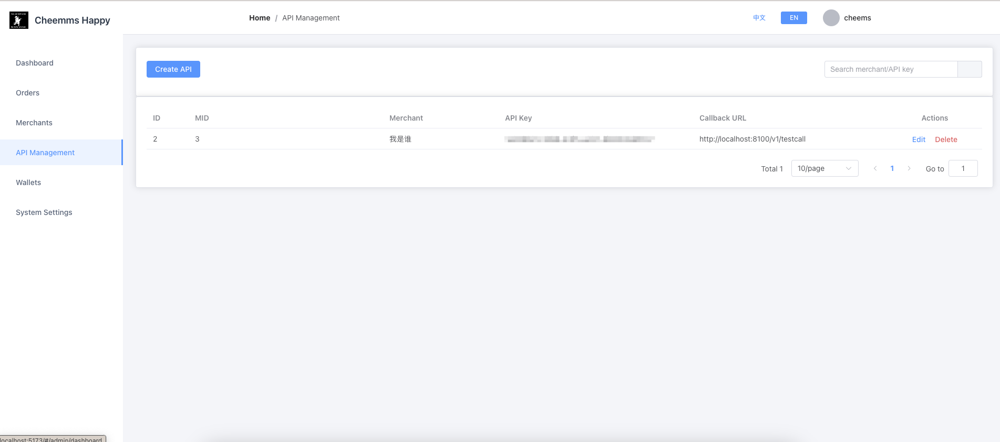
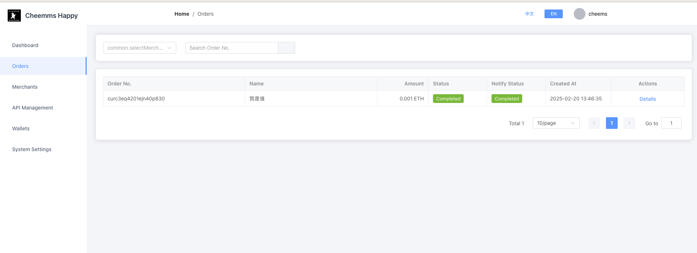
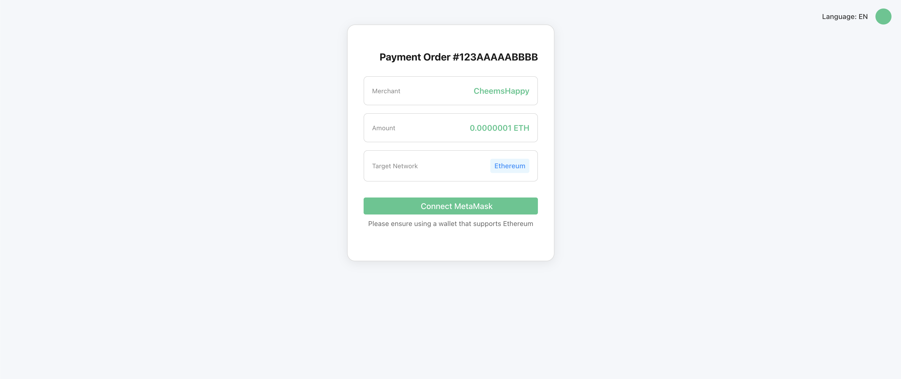
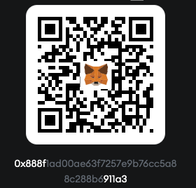

# CheemsHappy Pay System

[](https://github.com/CheemsHappyCoin/Pay/blob/main/LICENSE)
[](https://pump.fun/coin/DWYoXT4rMoj6VbMScrWQrRWzDhgf1BcRxDKQs6bgpump)


CheemsHappyCoin 是一个基于 Cheems 的社区，旨在庆祝 Cheems 的快乐精神。

Cheems 只想让你快乐，并传播快乐。

CheemsHappyPay 是一个开源的 Web3 第三方支付系统，为去中心化应用提供安全可靠的支付解决方案。支持用户系统创建订单后，跳转支付页面，唤起 web3 钱包进行支付，支付成功后，cheemshappy pay 会根据订单号和链上哈希确认支付状态，最终通知用户系统。

CheemsHappyPay 由 [CheemsHappy](https://pump.fun/coin/DWYoXT4rMoj6VbMScrWQrRWzDhgf1BcRxDKQs6bgpump) 社区驱动开发。

```
A meme created to celebrate the joyful spirit of Cheems.


Cheems just wants you to be happy and spread happiness around the world.
```

we build on [pump.fun](https://pump.fun/coin/DWYoXT4rMoj6VbMScrWQrRWzDhgf1BcRxDKQs6bgpump)

# Social Media

如果你想加入社区，请加入[TG - cheemshappy](https://t.me/+j7uij-U90lAyMzM1)

如果你想关注 cheemshappy，请加入[X - cheemshappycoin](https://x.com/CheemsHappyCoin)

如果你想体验或者赞助我们，可以访问以下地址

https://pay.cheemshappy.com/#/cheems/happy/pay/create

## 功能特性 ✨

### 核心功能

- 💰 加密货币收付款处理
- 📊 实时交易状态监控
- 🔗 区块链交易哈希追踪

### 商户服务

- 🛒 商户注册与管理
- 🔑 API 密钥生成与管理
- 📩 支付回调通知
- 📈 交易数据统计

### 安全特性

- 🔐 HMAC-SHA256 签名验证
- 🛡️ JWT + IP 绑定认证
- 🔒 交易黑名单机制
- 📡 请求参数加密传输

## 技术栈 🛠️

**后端核心**

- Go 1.20 + GORM
- JWT 认证 | Redis 缓存 | MySQL 5.7

**前端界面**

- Vue 3 | Element Plus | Axios

## 快速部署 🚀

### 环境要求

- Go 1.20+
- MySQL 5.7+
- Redis 6.2+
- Node.js 16+

### 安装步骤

## 建表语句

`cheemshappypay.sql`

```
git clone https://github.com/CheemsHappyCoin/Pay.git
cd Pay
go mod tidy
cd cmd/server
go build -o pay
./pay -config ./config/demo.yml
```

### 前端

```
cd web
npm install
npm run dev
```

### 配置文件

```
env: prod
http:
  host: 0.0.0.0
  port: 8100
security:
  api_sign:
    app_key: your_app_key
    app_security: your_app_secret
  jwt:
    key: your_jwt_secret_key
data:
  mysql:
    user: root:your_db_password@tcp(your_db_host:3306)/your_database?charset=utf8mb4&parseTime=True&loc=Local
  redis:
    addr: your_redis_host:6379
    password: "your_redis_password"
    db: 0
    read_timeout: 0.2s
    write_timeout: 0.2s

log:
  log_level: info
  encoding: json # json or console
  log_file_name: "./storage/logs/server.log"
  max_backups: 30
  max_age: 7
  max_size: 1024
  compress: true

# 注意配置文件中的rpc_endpoints，需要配置对应的rpc节点
rpc_endpoints:
  # EVM
  "1": "https://mainnet.infura.io/v3/YOUR_INFURA_KEY"
  "56": "https://bsc-dataseed.binance.org/"
  "137": "https://polygon-rpc.com"

  # test
  "5": "https://goerli.infura.io/v3/YOUR_INFURA_KEY"
  "97": "https://data-seed-prebsc-1-s1.binance.org:8545"

  # Tron
  "TRX": "grpc.trongrid.io:50051"
  "nile": "grpc.nile.trongrid.io:50051"

  # Solana
  "SOL": "https://api.mainnet-beta.solana.com"
  "SOLT": "https://api.testnet.solana.com"

```

### 系统说明

### 创建订单

api_key 是商户的 api_key

```
curl --location 'localhost:8100/v1/order/create' \
--header 'Content-Type: application/json' \
--header 'Authorization: {{merchant api_key}}' \
--data '{
    "order_no": "123AAAAABBBB",
    "m_id": 3,
    "coin": "ETH",
    "amount": "0.001",
    "return_url":"baidu.com",
    "chain":"11155111",
    "time_out":30,
    "remark": "reamek"
}'
```

### 商户回调系统

secret_key 是商户的 secret_key

```
func (h *OrderHandler) TestCall(ctx *gin.Context) {
	type TestCallbackReq struct {
		MerchantOrderNo string `json:"merchant_order_no" binding:"required"`
		OrderNo         string `json:"order_no" binding:"required"`
		Status          string `json:"status" binding:"required,oneof=success failed"`
		Amount          string `json:"amount" binding:"required"`
		Coin            string `json:"coin" binding:"required"`
		Sign            string `json:"sign" binding:"required"`
		Timestamp       int64  `json:"timestamp" binding:"required"`
	}

	req := new(TestCallbackReq)
	if err := ctx.ShouldBindJSON(req); err != nil {
		v1.HandleError(ctx, http.StatusBadRequest, v1.ErrBadRequest, nil)
		return
	}
	sign := generateSignature(map[string]interface{}{
		"merchant_order_no": req.MerchantOrderNo,
		"order_no":          req.OrderNo,
		"status":            req.Status,
		"amount":            req.Amount,
		"coin":              req.Coin,
		"timestamp":         req.Timestamp,
	}, "{{merchant secret_key}}")
	if req.Sign != sign {
		v1.HandleError(ctx, http.StatusUnauthorized, v1.ErrUnauthorized, nil)
		return
	}
	v1.HandleSuccess(ctx, "ok")
}
```

### 使用说明

1. 创建系统主钱包
2. 创建商户
3. 新增商户钱包或者自动生成商户钱包
4. 配置商户 api（包括回调地址和秘钥），秘钥用作回调验签

### 系统页面


#### 商户管理



#### api 管理



#### 订单管理



#### 支付



## 赞助

如果你想赞助 CheemsHappy

AC: 0x888f1AD00aE63f7257e9B76Cc5a88C288b6911a3



## License

本项目使用 MIT 许可证。详见 [LICENSE](LICENSE) 文件。

## Star History

[](https://star-history.com/#CheemsHappyCoin/Pay&Date)

## 发展路线图 🗺️

🚀 **核心**

- [x] 多链支付支持（EVM、波场、Solana）
- [x] 基础商户管理系统
- [x] 商户钱包管理
- [x] 订单管理
- [x] 支付回调
- [x] 交易状态监控
- [x] 交易数据统计

## 未来发展

- [ ] 添加多钱包、多链支持
- [ ] 添加商户费率支持

> 持续关注更新！请关注我们的[Twitter](https://x.com/CheemsHappyCoin)获取最新动态。
