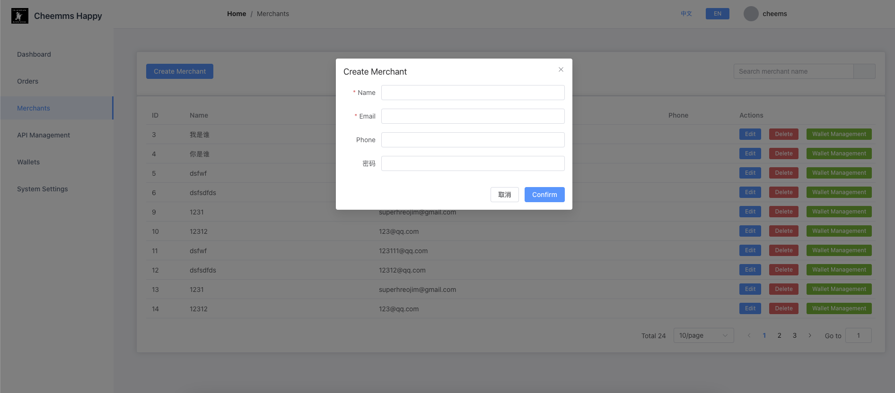
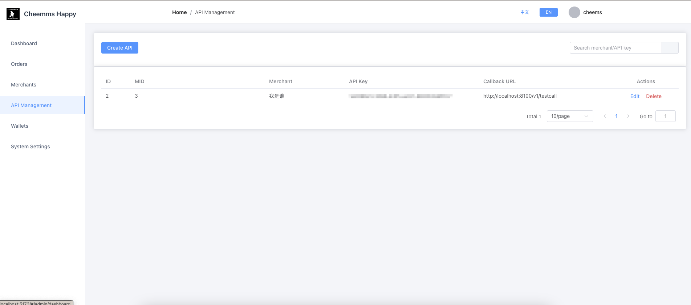
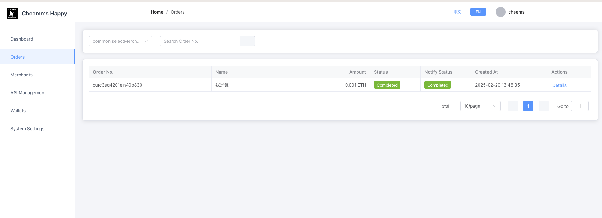
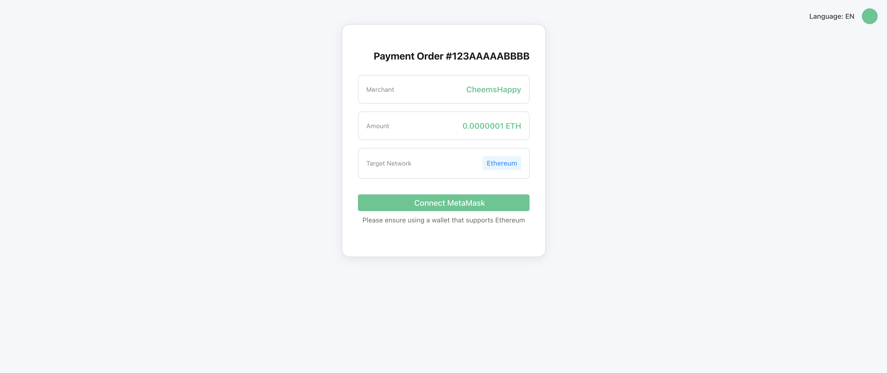
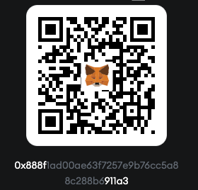

# CheemsHappy Pay System

[](https://github.com/CheemsHappyCoin/Pay/blob/main/LICENSE)
[](https://pump.fun/coin/DWYoXT4rMoj6VbMScrWQrRWzDhgf1BcRxDKQs6bgpump)


Cheems just wants you to be happy and spread happiness around the world.

CheemsHappyPay is an open-source Web3 third-party payment system that provides secure and reliable payment solutions for decentralized applications. It allows user systems to create orders, redirect to the payment page, and invoke the web3 wallet to pay. After successful payment, cheemshappy pay will confirm the payment status based on the order number and blockchain hash, and finally notify the user system.

CheemsHappyPay is developed by the [CheemsHappy](https://pump.fun/coin/DWYoXT4rMoj6VbMScrWQrRWzDhgf1BcRxDKQs6bgpump) community.

```
A meme created to celebrate the joyful spirit of Cheems.


Cheems just wants you to be happy and spread happiness around the world.
```

We build on [pump.fun](https://pump.fun/coin/DWYoXT4rMoj6VbMScrWQrRWzDhgf1BcRxDKQs6bgpump)

# Social Media

if you want to join the community, please join [TG - cheemshappy](https://t.me/+j7uij-U90lAyMzM1)

If you want to follow CheemsHappy, please join [X - cheemshappycoin](https://x.com/CheemsHappyCoin)

if you want to experience or sponsor us, you can visit the following address

https://pay.cheemshappy.com/#/cheems/happy/pay/create

## Features ✨

### Core Features

- 💰 Cryptocurrency payment processing
- 📊 Real-time transaction status monitoring
- 🔗 Blockchain transaction hash tracking

### Merchant Services

- 🛒 Merchant registration and management
- 🔑 API key generation and management
- 📩 Payment callback notifications
- 📈 Transaction data statistics

### Security Features

- 🔐 HMAC-SHA256 signature verification
- 🛡️ JWT + IP binding authentication
- 🔒 Transaction blacklist mechanism
- 📡 Encrypted transmission of request parameters

## Tech Stack 🛠️

**Backend Core**

- Go 1.20 + GORM
- JWT authentication | Redis caching | MySQL 5.7

**Frontend Interface**

- Vue 3 | Element Plus | Axios

## Quick Deployment 🚀

### Environment Requirements

- Go 1.20+
- MySQL 5.7+
- Redis 6.2+
- Node.js 16+

### Installation Steps

#### DB Table

`cheemshappypay.sql`

```
git clone https://github.com/CheemsHappyCoin/Pay.git
cd Pay
go mod tidy
cd cmd/server
go build -o pay
./pay -config ./config/demo.yml
```

### Frontend

```
cd web
npm install
npm run dev
```

### Configuration File

```
env: prod
http:
  host: 0.0.0.0
  port: 8100
security:
  api_sign:
    app_key: your_app_key
    app_security: your_app_secret
  jwt:
    key: your_jwt_secret_key
data:
  mysql:
    user: root:your_db_password@tcp(your_db_host:3306)/your_database?charset=utf8mb4&parseTime=True&loc=Local
  redis:
    addr: your_redis_host:6379
    password: "your_redis_password"
    db: 0
    read_timeout: 0.2s
    write_timeout: 0.2s

log:
  log_level: info
  encoding: json # json or console
  log_file_name: "./storage/logs/server.log"
  max_backups: 30
  max_age: 7
  max_size: 1024
  compress: true

# Note: The rpc_endpoints in the configuration file need to be configured with the corresponding RPC nodes.
rpc_endpoints:
  # EVM
  "1": "https://mainnet.infura.io/v3/YOUR_INFURA_KEY"
  "56": "https://bsc-dataseed.binance.org/"
  "137": "https://polygon-rpc.com"

  # Test
  "5": "https://goerli.infura.io/v3/YOUR_INFURA_KEY"
  "97": "https://data-seed-prebsc-1-s1.binance.org:8545"

  # Tron
  "TRX": "grpc.trongrid.io:50051"
  "nile": "grpc.nile.trongrid.io:50051"

  # Solana
  "SOL": "https://api.mainnet-beta.solana.com"
  "SOLT": "https://api.testnet.solana.com"

```

### Admin

```
user: ch@cheemshappy.com
password: cheemshappy.com
```

### System Description

### Create Order

The api_key is the merchant's api_key.

```
curl --location 'localhost:8100/v1/order/create' \
--header 'Content-Type: application/json' \
--header 'Authorization: {{merchant api_key}}' \
--data '{
    "order_no": "123AAAAABBBB",
    "m_id": 3,
    "coin": "ETH",
    "amount": "0.001",
    "return_url":"baidu.com",
    "chain":"11155111",
    "time_out":30,
    "remark": "remark"
}'
```

### Merchant Callback System

The secret_key is the merchant's secret_key.

```
func (h *OrderHandler) TestCall(ctx *gin.Context) {
	type TestCallbackReq struct {
		MerchantOrderNo string `json:"merchant_order_no" binding:"required"`
		OrderNo         string `json:"order_no" binding:"required"`
		Status          string `json:"status" binding:"required,oneof=success failed"`
		Amount          string `json:"amount" binding:"required"`
		Coin            string `json:"coin" binding:"required"`
		Sign            string `json:"sign" binding:"required"`
		Timestamp       int64  `json:"timestamp" binding:"required"`
	}

	req := new(TestCallbackReq)
	if err := ctx.ShouldBindJSON(req); err != nil {
		v1.HandleError(ctx, http.StatusBadRequest, v1.ErrBadRequest, nil)
		return
	}
	sign := generateSignature(map[string]interface{}{
		"merchant_order_no": req.MerchantOrderNo,
		"order_no":          req.OrderNo,
		"status":            req.Status,
		"amount":            req.Amount,
		"coin":              req.Coin,
		"timestamp":         req.Timestamp,
	}, "{{merchant secret_key}}")
	if req.Sign != sign {
		v1.HandleError(ctx, http.StatusUnauthorized, v1.ErrUnauthorized, nil)
		return
	}
	v1.HandleSuccess(ctx, "ok")
}
```

### Usage Instructions

1. Create the main wallet for the system.
2. Create a merchant.
3. Add a merchant wallet or automatically generate a merchant wallet.
4. Configure the merchant API (including callback URL and secret key), which is used for callback signature verification.

### System Pages


#### Merchant Management



#### API Management



#### Order Management



#### Pay



## Sponsorship

If you want to sponsor CheemsHappy

AC: 0x888f1AD00aE63f7257e9B76Cc5a88C288b6911a3



## License

This project is licensed under the MIT License. See the [LICENSE](LICENSE) file for details.

## Star History

[](https://star-history.com/#CheemsHappyCoin/Pay&Date)

## Roadmap 🗺️

🚀 **Core**

- [x] Multi-chain payment support (EVM, Tron, Solana)
- [x] Basic merchant management system
- [x] Merchant wallet management
- [x] Order management
- [x] Payment callback
- [x] Transaction status monitoring
- [x] Transaction data statistics

## Future Development

- [ ] Add multi-wallet, multi-chain support
- [ ] Add merchant fee support

> Please follow our [Twitter](https://x.com/CheemsHappyCoin) for the latest updates.
